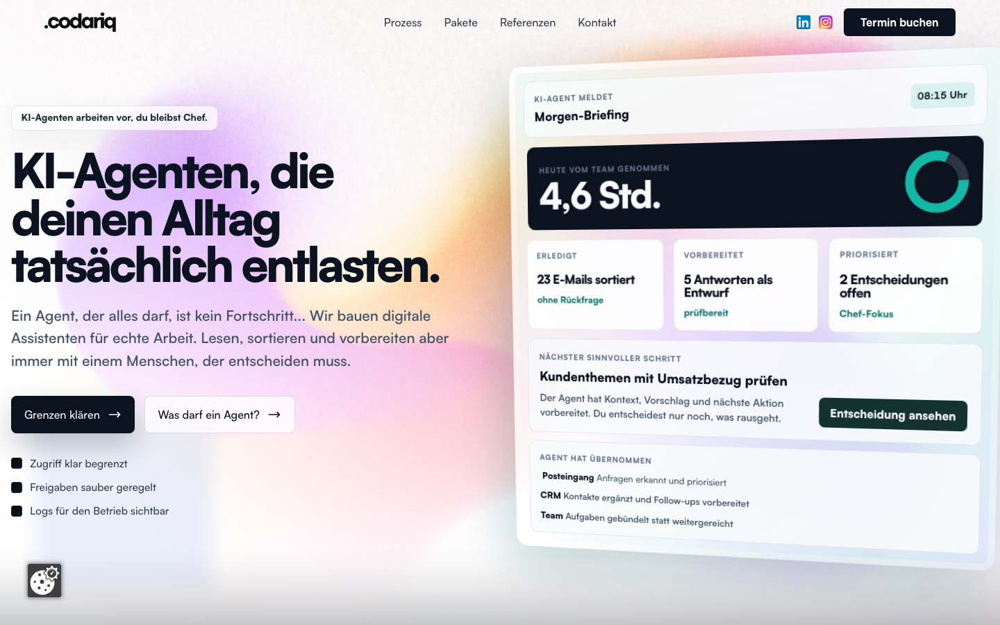

# Codariq Landing Page

[](https://github.com/bpnace/codariq_v1/actions/workflows/ci.yml)




Astro-powered live landing page and lead flow for a DACH AI automation offer.
The project combines conversion copy, quiz UX, legal pages, SEO structure,
static deployment, and browser-level validation.

## Case study

### Problem
Small teams need concrete automation offers, but most AI landing pages stay too
abstract. The page had to explain what an agent may do, route visitors into the
right package, and stay legally credible for the German market.

### Solution
I built an Astro site around a clear automation offer, package sections, lead
capture, quiz-style qualification, blog/SEO content, and legal pages for a DACH
audience.

### Engineering decisions
- Static Astro output for simple hosting and fast page delivery
- Reusable content sections for package, process, references, FAQ, and lead flow
- Structured metadata, sitemap, robots, and schema support
- Vitest and Playwright coverage around homepage, quiz, and lead-flow behavior
- Live screenshot captured from `https://codariq.de`

### Outcome
Codariq works as a production landing case: it shows positioning, frontend
execution, compliance awareness, and conversion-focused product thinking in one
repository.

## What this shows

- Production-style Astro site with reusable content sections and landing routes
- Interactive automation check / quiz flow with form validation and submission handling
- SEO, schema, sitemap, legal pages, and German-market compliance framing
- Vitest and Playwright coverage for homepage, quiz, and complete lead flow
- Static build workflow that can be uploaded to conventional web hosting

## 🎯 Project Overview

**Codariq** builds controllable AI agents and agent workflows for self-employed professionals, small teams, and KMU across Germany, Austria, and Switzerland.

### Target Audience

- **Company Size:** Self-employed individuals and small teams (1-50 people)
- **Market Focus:** German-speaking solo entrepreneurs and small businesses (DACH region)
- **Industries:** Professional services, consulting, freelancers, agencies
- **Pain Points:** Email overload, document processing, backoffice tasks, repetitive manual work

### Key Services

1. **Prozess-Automatisierung** - Business process automation
2. **Kundenservice-KI** - AI-powered customer service solutions
3. **Document Workflows** - Automated document processing
4. **Intelligente Datenanalyse** - One-time data analysis package

## 🚀 Quick Start

### Prerequisites

- **Node.js 18 LTS** (managed via Volta)
- **Git** for version control
- **GitHub account** for repository management

### 1. Initial Setup

```bash
# Clone the repository
git clone https://github.com/bpnace/codariq_v1.git
cd codariq_v1

# Install Node.js 18 LTS via Volta
volta install node@18

# Install dependencies
npm ci
```

### 2. Development Commands

```bash
# Start development server
npm run dev              # → localhost:4321

# Build for production
npm run build           # → outputs to dist/

# Preview production build
npm run preview         # → test build locally

# Run all tests
npm run test           # → vitest + playwright + axe + lighthouse

# Lint and format
npm run lint           # → ESLint + Prettier
npm run format         # → Auto-fix formatting
```

### 3. Testing

GitHub Actions runs the repository CI workflow. Use the commands below for the
same local checks before pushing changes.

#### Test Commands

```bash
# Unit tests (Vitest)
npm run test           # → Watch mode for development
npm run test:run       # → Single run (ideal for CI/CD)

# E2E tests (Playwright)
npm run test:e2e       # → Headless browser tests
npm run test:e2e:ui    # → Interactive UI for debugging
```

#### Testing Setup

**Vitest (Unit Tests)**

- **Environment**: happy-dom (browser-like DOM)
- **Location**: `src/**/*.test.{js,ts,jsx,tsx}`
- **Configuration**: [vitest.config.ts](vitest.config.ts)
- **Setup**: [src/test/setup.ts](src/test/setup.ts)

**Playwright (E2E Tests)**

- **Environment**: Chromium (headless)
- **Location**: `src/test/**/*.spec.ts`
- **Configuration**: [playwright.config.ts](playwright.config.ts)
- **Features**: Auto-start dev server, trace on retry

**Test Files**:

- [src/test/helpers.test.ts](src/test/helpers.test.ts) - Utility function tests
- [src/test/agent-readiness.spec.ts](src/test/agent-readiness.spec.ts) - Quiz component E2E
- [src/test/agent-readiness-flow.spec.ts](src/test/agent-readiness-flow.spec.ts) - Complete quiz flow
- [src/test/home.spec.ts](src/test/home.spec.ts) - Homepage E2E

### 4. Ordnerstruktur (Project Structure)

```
codariq/
├── src/
│   ├── components/              # Reusable UI components
│   │   ├── LandingHeroSection.astro          # Main hero with dual CTA
│   │   ├── TrustSignalsSection.astro         # Trust badges (DSGVO, EU AI Act, Hosting)
│   │   ├── AgentReadinessSection.astro       # Problem and readiness framing
│   │   ├── PricingTiersSection.astro         # Services and pricing tiers
│   │   ├── UseCaseProofSection.astro         # Use cases and customer feedback
│   │   ├── DeliveryProcessSection.astro      # Delivery timeline
│   │   ├── LeadCaptureSection.astro          # Contact form and calendar booking link
│   │   ├── FAQ.astro           # Accordion FAQ
│   │   ├── FAQSchema.astro     # Structured data for FAQ
│   │   ├── BreadcrumbSchema.astro # Breadcrumb schema
│   │   ├── BlogInsightsSection.astro         # Blog post previews
│   │   ├── BlogConversionSection.astro      # Blog CTA wrapper
│   │   ├── SeoIntentEntryPointsSection.astro # Homepage SEO entry links
│   │   ├── SeoLandingPageTemplate.astro     # SEO landing page template
│   │   ├── RedirectPage.astro               # Static compatibility redirect
│   │   └── UseCaseCardsSection.astro        # Use case grid
│   │
│   ├── layouts/
│   │   └── Base.astro          # Main layout with navigation
│   │
│   ├── pages/
│   │   ├── index.astro         # Landing page
│   │   ├── faq.astro           # FAQ page
│   │   ├── datenschutz.astro   # Privacy policy (DSGVO)
│   │   ├── impressum.astro     # Legal notice (DDG)
│   │   ├── agb.astro           # Terms of service
│   │   ├── cookie-richtlinien.astro # Cookie policy
│   │   ├── agent-readiness.astro # Interactive quiz
│   │   ├── ki-agenten-selbststaendige.astro
│   │   ├── ki-agenten-kleine-teams.astro
│   │   ├── ki-agenten-gruender.astro
│   │   │
│   │   ├── api/                # Server-side endpoints
│   │   │   ├── newsletter.ts   # Newsletter signup
│   │   │   ├── dashboard-waitlist.ts # Waitlist signup
│   │   │   └── submit.ts       # Quiz submission
│   │   │
│   │   └── blog/               # Blog system (5 posts)
│   │       ├── index.astro     # Blog listing
│   │       ├── [slug].astro    # Dynamic template
│   │       ├── ki-teams-vorbereiten.astro
│   │       ├── ki-agenten-roi-berechnen.astro
│   │       ├── ki-integration-5-schritte.astro
│   │       ├── ki-compliance-2025.astro
│   │       └── ki-projekte-retten.astro
│   │
│   ├── utils/                  # Utility functions
│   │   ├── quiz.ts            # Quiz logic & calculations
│   │   ├── validation.ts      # Form validation
│   │   └── submit.ts          # Form submission helpers
│   │
│   ├── lib/
│   │   └── drupal.ts          # Drupal integration
│   │
│   ├── scripts/                # Client-side scripts
│   │   └── agent-readiness.ts # Quiz behavior
│   │
│   ├── test/                   # Test files
│   │   ├── setup.ts           # Vitest setup
│   │   ├── helpers.test.ts    # Unit tests
│   │   ├── home.spec.ts       # Homepage E2E
│   │   ├── agent-readiness.spec.ts       # Quiz E2E
│   │   └── agent-readiness-flow.spec.ts  # Quiz flow E2E
│   │
│   └── styles/
│       └── global.css         # Global styles & animations
│
├── public/                     # Static assets
│   ├── images/
│   │   ├── logos/             # Company logos
│   │   ├── badges/            # Trust badges
│   │   ├── hero/              # LandingHeroSection images
│   │   ├── dashboard/         # Dashboard mockups
│   │   └── testimonials/      # Testimonial photos
│   ├── fonts/
│   │   ├── Satoshi-Variable.woff2
│   │   └── Satoshi-Variable.ttf
│   ├── .htaccess              # Server config
│   ├── robots.txt             # SEO directives
│   ├── manifest.json          # PWA manifest
│   └── [favicons]             # Various icon sizes
│
├── Configuration Files
│   ├── astro.config.mjs       # Astro framework
│   ├── tailwind.config.js     # Tailwind CSS
│   ├── vitest.config.ts       # Unit testing
│   ├── playwright.config.ts   # E2E testing
│   ├── tsconfig.json          # TypeScript
│   ├── eslint.config.js       # Linting rules
│   ├── package.json           # Dependencies
│   └── .env                   # Environment vars (not in git)
│
└── dist/                       # Build output (generated)
```

## 🎨 Design System

### Color Scheme

- **Primary:** Orange (#EA580C) - CTA buttons and accents
- **Text:** Gray scale (900-600) for hierarchy
- **Background:** White with gray-50 for cards
- **Navigation:** Milky glass effect with backdrop blur

### Typography

- **Font:** Satoshi Variable (custom font family)
- **Hierarchy:** Bold headlines, medium body text
- **Responsive:** Scales from mobile to desktop

### Recent Design Updates

- **Milky Glass Navigation** - Fixed header with backdrop blur
- **Gradient CTA Buttons** - Orange gradient from top-left to bottom-right
- **DeliveryProcessSection Component Redesign** - Numbers top-left, icons top-right, fixed heights
- **Testimonial Real Photos** - Replaced SVG graphics with randomuser.me images
- **Google Calendar Booking** - External booking link in LeadCaptureSection
- **Card-based Layout** - Consistent spacing and text alignment

## 📄 Legal Pages

All legal pages are DSGVO-compliant and include real business information:

- **Datenschutz** - DSGVO-compliant privacy policy with structured data processing table
- **Impressum** - Legal notice per § 5 DDG with Codariq business details
- **AGB** - Comprehensive B2B terms for KI-automation services
- **Cookie-Richtlinien** - TTDSG-compliant cookie policy
- **FAQ** - 8 detailed questions about AI automation

Recent Updates (January 2025):

- Updated all legal texts with legitimate Codariq business information
- Added proper DDG compliance tables for Impressum
- Implemented DSGVO Art. 6 structured data processing overview
- Included real contact details: Tarik Arthur Marshall, Berlin address
- Added professional service terms covering analysis, design, development phases

## 💰 Pricing Strategy

The site uses **price ranges** instead of specific amounts:

- **Simple automations:** Low five-digit range
- **Complex projects:** Mid to high five-digit range
- **Cost savings:** Mid to high five-digit annual savings
- **ROI:** Typically achieved within 6-12 months

Package pricing in DeliveryProcessSection section maintains specific pricing for transparency.

## 🛠️ Technical Features

### Performance Optimizations

- **Static Site Generation** via Astro v5
- **Minimal JavaScript** - No heavy animations or interactions
- **Optimized Images** - WebP format with lazy loading
- **Font Loading** - Preloaded variable fonts

### Waitlist Integration

- **n8n Webhook** - Automated email collection workflow
- **Google Sheets** - Real-time data storage and management
- **Duplicate Detection** - Prevents multiple entries from same email
- **Basic Auth Security** - Protected webhook endpoints
- **German Error Messages** - Localized user feedback
- **Response Handling** - Success, duplicate, and error states

### Accessibility

- **WCAG 2.1 AA** compliance
- **Semantic HTML** structure
- **Focus management** for keyboard navigation
- **Screen reader** optimized content

### SEO & Analytics

- **Structured Data** - Organization and services schema
- **Meta Tags** - Comprehensive OpenGraph and Twitter cards
- **German Language** - Proper hreflang and locale settings
- **Performance** - Core Web Vitals optimized

## ⚙️ Configuration Files

### Testing Configuration

**[vitest.config.ts](vitest.config.ts)** - Unit test configuration

```typescript
{
  environment: "happy-dom",     // Browser-like DOM
  globals: true,                 // Global test APIs
  include: ["src/**/*.test.{js,ts,jsx,tsx}"],
  exclude: ["src/**/*.spec.{js,ts,jsx,tsx}"],
  setupFiles: ["src/test/setup.ts"]
}
```

**[playwright.config.ts](playwright.config.ts)** - E2E test configuration

```typescript
{
  testDir: "src/test",
  testMatch: "**/*.spec.ts",
  baseURL: "http://localhost:4321",
  webServer: {
    command: "npm run dev",      // Auto-start dev server
    reuseExistingServer: true
  }
}
```

### Framework Configuration

**[astro.config.mjs](astro.config.mjs)** - Astro framework settings

- Site URL: `https://codariq.de`
- Sitemap generation with German locale (de-DE)
- Trailing slash: `never` (clean URLs)
- Build format: `file` (generates .html files)
- Vite integration with Tailwind CSS plugin

**[tailwind.config.js](tailwind.config.js)** - Tailwind CSS customization

- Content paths: All Astro, HTML, JS, TS files in `src/`
- Custom fonts: Satoshi Variable font family
- Extended theme with custom typography

**[tsconfig.json](tsconfig.json)** - TypeScript compiler options

- Extends: `astro/tsconfigs/strict`
- Includes: `.astro/types.d.ts` and all source files
- Excludes: `dist/` build output

**[eslint.config.js](eslint.config.js)** - Code quality rules

- Parser: TypeScript ESLint parser
- Plugins: TypeScript ESLint
- Rules: Unused vars detection, no-console warnings, prefer-const
- Ignores: `dist/`, `.astro/`, and `.astro` files

## 🚢 Deployment

### Current Hosting

- **Repository:** https://github.com/bpnace/codariq_v1.git
- **Domain:** codariq.de (configured for German market)
- **Hosting:** Strato Web Hosting
- **SSL:** Automatically managed

### Deployment DeliveryProcessSection

```bash
# Build for production
npm run build

# Deploy to Strato via SFTP (automated script)
expect sftp_full_upload.expect
```

**Deployment Script:** The `sftp_full_upload.expect` script automatically uploads the entire `dist/` folder to the Strato server, including:

- All HTML files
- Static assets (images, fonts, logos)
- `.htaccess` configuration
- Sitemap and robots.txt

**Post-Deployment Verification:**

```bash
# Test main pages for redirect chains
curl -I https://codariq.de/faq
# Should return: HTTP/2 200

# Test redirect handling
curl -I https://www.codariq.de/faq
# Should return: HTTP/2 301 → https://codariq.de/faq
```

### SEO Deployment Notes (October 2025)

After deploying SEO fixes:

1. **Verify .htaccess is active:**

   ```bash
   curl -I https://codariq.de/faq
   # Must return HTTP 200, not 301
   ```

2. **Request Google re-indexing:**
   - Visit [Google Search Console](https://search.google.com/search-console)
   - Use URL Inspection tool for main pages
   - Click "Request Indexing" for each URL

3. **Monitor for 2 weeks:**
   - Check "Page Indexing" report daily
   - Watch for "Seite mit Weiterleitung" to drop to 0
   - Verify all blog posts get indexed

See [DEPLOYMENT_SUMMARY.md](DEPLOYMENT_SUMMARY.md) for detailed deployment test results and [SEO_FIXES_DOCUMENTATION.md](SEO_FIXES_DOCUMENTATION.md) for technical implementation details.

## 🔒 Security & Compliance

### DSGVO Compliance

- **Cookie-free analytics** preferred
- **Data minimization** - Only collect necessary data
- **German servers** - EU data residency
- **Transparent policies** - Clear privacy notices

### Security Headers

- Content Security Policy implemented
- HTTPS enforced across all pages
- No third-party tracking without consent

### Security Improvements (Januar 2025)

- ✅ Moved webhook credentials from client-side to server-side API endpoints
- ✅ Created `/api/newsletter` and `/api/dashboard-waitlist` endpoints
- ✅ Credentials stored in `.env` file (not committed to git)
- ✅ Verified: No credentials exposed in build output
- ✅ All newsletter forms (footer, blog, dashboard) use secure server-side endpoints

## 📊 Conversion Optimization

### Key Conversion Elements

1. **Orange CTA buttons** - Consistent brand color
2. **Social proof** - use-case proof with company references
3. **Clear value props** - PricingTiersSection focused on SME pain points
4. **Trust signals** - Compliance badges and guarantees
5. **Reduced friction** - Simple contact forms

### A/B Testing Opportunities

- LandingHeroSection headline variations (problem vs. solution focused)
- CTA button text ("Termin buchen" vs. "Demo anfragen")
- Trust badge placement and messaging
- Testimonial layout and emphasis

## 🤝 Contributing

### Code Standards

- ESLint + Prettier for consistent formatting
- Component-based architecture
- Responsive design mandatory
- Accessibility testing required

### Development Workflow

1. Feature branches from main
2. Pull request reviews
3. Automated testing via CI/CD
4. Performance budget enforcement

---

## 🎯 Current Status (October 2025)

**✅ Completed Features:**

- Complete Codariq rebranding from zynapse/stackwerkhaus
- Real legal pages with legitimate business information
- **KI-Dashboard Waitlist Integration** - Fully functional with n8n webhook + Google Sheets
- **Blog System** - 4 comprehensive blog posts with SEO optimization
- **Enhanced Navigation** - Added "Insights" link to blog section
- **Footer Redesign** - 4-column layout with newsletter signup
- **Responsive Animations** - Scroll-triggered animations throughout
- DeliveryProcessSection component redesign with fixed text alignment
- Testimonial photos from randomuser.me
- Gradient CTA buttons with consistent styling
- DSGVO/DDG/TTDSG compliance implementation
- **Pricing Updates** - Real pricing with customer discounts
- **Meta Tags & Structured Data** - Complete SEO implementation
- **🆕 SEO Redirect Fixes** - Eliminated all redirect chains for perfect indexing

**🔄 Recent Major Updates (October 2025):**

### SEO & Google Search Console Fixes ✅

**Problem Solved:** Eliminated all "Seite mit Weiterleitung" errors in Google Search Console

**What Was Fixed:**

- ✅ **Zero redirect chains** - All canonical URLs now return HTTP 200 directly
- ✅ **Removed SearchAction** - No more fake search URLs being indexed
- ✅ **Optimized .htaccess** - Single combined redirects for www/HTTPS
- ✅ **DirectorySlash Off** - Internal rewrites serve index.html without external redirects

**Test Results (Production - Oct 15, 2025):**

```
✅ https://codariq.de/faq                         → HTTP 200 (no redirect)
✅ https://codariq.de/impressum                   → HTTP 200 (no redirect)
✅ https://codariq.de/blog/ki-teams-vorbereiten   → HTTP 200 (no redirect)
✅ https://codariq.de/blog/ki-agenten-roi-berechnen → HTTP 200 (no redirect)

✅ https://codariq.de/faq/     → 301 → /faq (single redirect)
✅ https://www.codariq.de/faq  → 301 → /faq (single redirect)
✅ http://codariq.de/faq       → 301 → /faq (single redirect)
✅ http://www.codariq.de/faq   → 301 → /faq (single redirect)
```

**Expected Impact:**

- **Week 1-2:** "Seite mit Weiterleitung" errors drop to 0
- **Week 2-4:** All pages properly indexed in Google
- **Month 1-3:** Increased organic traffic from blog content, better keyword connections

**Files Modified:**

- `public/.htaccess` - Added DirectorySlash Off, combined redirects, internal rewrites
- `src/layouts/Base.astro` - Removed SearchAction, added noindex for search params
- See [SEO_FIXES_DOCUMENTATION.md](SEO_FIXES_DOCUMENTATION.md) for complete technical details

**Previous Updates:**

- **Waitlist Functionality:** Email collection for KI-Dashboard with duplicate detection
- **Blog Content:** 4 detailed German blog posts (2000+ words each)
- **Navigation Enhancement:** Removed "Vorgehen" link, added "Insights"
- **Footer Optimization:** Dark theme with industry leader logos
- **Performance:** Optimized for mobile and desktop viewing
- **CTA Updates:** Changed from "Jetzt anfragen" to "Jetzt starten"

**📋 Next Tasks:**

- ✅ ~~Eliminate Google Search Console redirect errors~~ (COMPLETED Oct 15, 2025)
- Request re-indexing in Google Search Console (immediate action)
- Monitor indexing improvements over 2-4 weeks
- Mobile-first performance optimization
- Core Web Vitals improvement
- Advanced analytics implementation

## 📞 Support

For questions about this project:

- **Technical Issues:** Create GitHub issue
- **Business Questions:** kontakt@codariq.de
- **Performance Monitoring:** Core Web Vitals dashboard

---

_Built with love • © 2025 Codariq_
